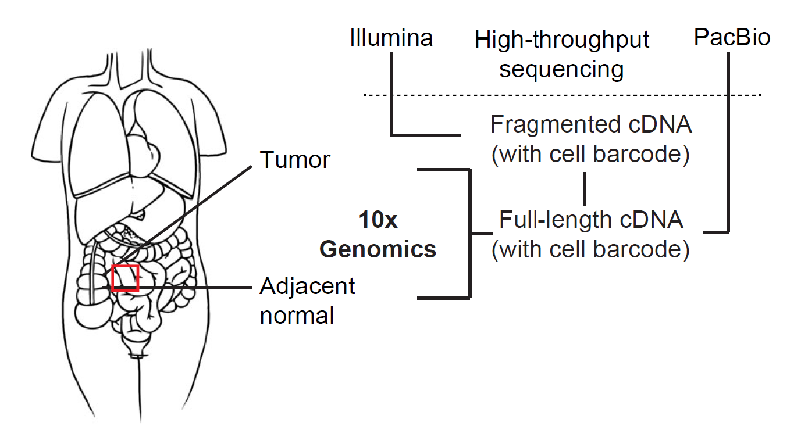

# An isoform-resolution transcriptomic atlas of colorectal cancer from long-read single-cell sequencing

This repository contains data analysis and demo code for the manuscript 

[Li, Zhongxiao, et al. "An isoform-resolution transcriptomic atlas of colorectal cancer from long-read single-cell sequencing" bioRxiv, 2023](https://www.biorxiv.org/content/10.1101/2023.04.21.536771v3)
<div align="center">
  
</div>
Before formal publication, please use the following information for citation

```
@article {Li2023.04.21.536771,
	author = {Zhongxiao Li and Bin Zhang and Jia Jia Chan and Hossein Tabatabaeian and Qing Yun Tong and Xiao Hong Chew and Xiaonan Fan and Patrick Driguez and Charlene Chan and Faith Cheong and Shi Wang and Bei En Siew and Ian Jse-Wei Tan and Kai-Yin Lee and Bettina Lieske and Wai-Kit Cheong and Dennis Kappei and Ker-Kan Tan and Xin Gao and Yvonne Tay},
	title = {An isoform-resolution transcriptomic atlas of colorectal cancer from long-read single-cell sequencing},
	elocation-id = {2023.04.21.536771},
	year = {2023},
	doi = {10.1101/2023.04.21.536771},
	publisher = {Cold Spring Harbor Laboratory},
	URL = {https://www.biorxiv.org/content/early/2023/09/26/2023.04.21.536771},
	eprint = {https://www.biorxiv.org/content/early/2023/09/26/2023.04.21.536771.full.pdf},
	journal = {bioRxiv}
}
```

## Prerequisites
The data analysis code in this repo was developed with the following Python dependencies:
- Python 3.8.13
- numpy 1.22.4
- scipy 1.7.0
- sandas 1.3.2
- h5py 3.7.0
- matplotlib 3.5.2
- seaborn 0.11.2
- anndata 0.8.0
- scanpy 1.9.1
- jupyter-spaces 0.3.0

The code was also developed with the following R dependencies:
- R 4.0.5
- anndata 0.7.5.6
- seurat 4.0.1
- monocle3 1.0.1

If you are using a package of a different version, you need to modify the code if there is an API change.
## Part 1: 10x Illumina data analysis
<div align="center">
  
</div>

This part demonstrates how to use the processed 10x-Illumina component of the atlas. Relevant analyses are in `10x-Illumina.ipynb`.

## Part 2: 10x PacBio data analysis
<div align="center">
  
</div>

This part demonstrates how to use the processed 10x-PacBio component of the atlas. Relevant analyses are in `10x-PacBio.ipynb`.

## Part 3: Epithelial lineage analysis
<div align="center">
  
</div>

This part demonstrates the identified epithelial cell differentiation lineages. Relevant analyses are in `epithelial_lineage_analysis.ipynb`.

## Part 4: Neoantigen selection
<div align="center">
  
</div>

This part demonstrates how to obtain tumor-recurrent neoepitopes from novel transcripts and how to optimize a panel of neoepitopes with high binding affinity to the patients' alleles. Relevant analyses are in `neoantigen_candidates.ipynb`.