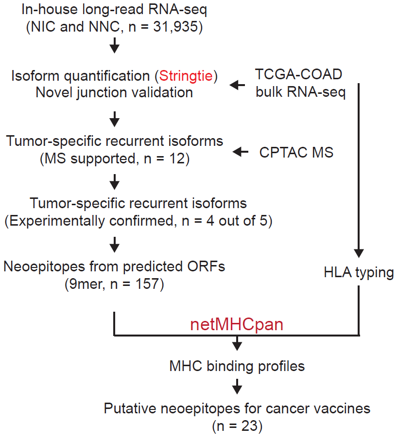

# An isoform-resolution transcriptomic atlas of colorectal cancer from long-read single-cell sequencing
This repository contains data analysis code for the manuscript 

Li,Zhongxiao, et al. "An isoform-resolution transcriptomic atlas of colorectal cancer from long-read single-cell sequencing" \[[bioRxiv](https://www.biorxiv.org/)\]
## Part 1: 10x Illumina data analysis

  

Relavant analysis is in `10xIllumina_clinical_samples.ipynb`

## Part 2: 10x PacBio data analysis

  

Relavant analysis is in `PacBio_isoform_analysis.ipynb`

## Part 3: Epithelial lineage analysis

  

Relavant analysis is in `lineage_analysis.ipynb`

## Part 4: Neoantigen selection

  

Relavant analysis is in `neoantigen_candidates.ipynb`